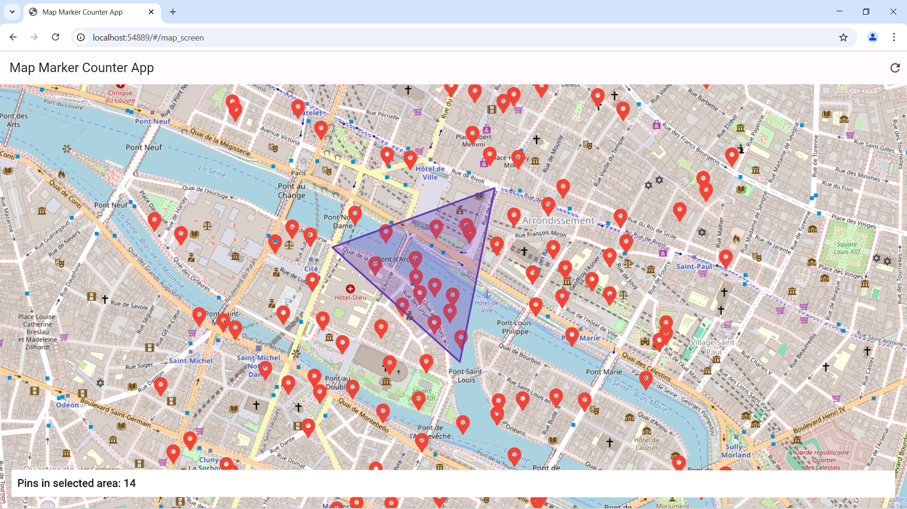
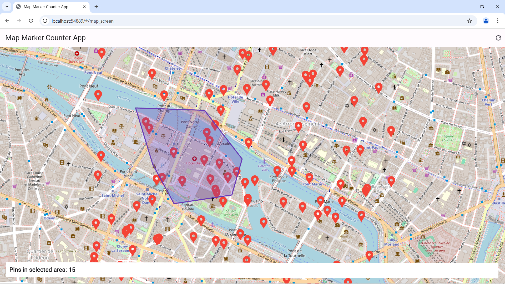

# Flutter OpenStreetMap Marker Counter App 🌍📍

An interactive Flutter web application that allows users to **select an area on the map** and instantly see how many locations (pins) are inside the selected region.

## ✨ Features
- **Interactive Map** – Explore and interact with the map easily.
- **Select Any Area** – Click on the map to start drawing a custom shape.
- **Dynamic Shape Creation** – Drag and adjust points to refine your selection.
- **Real-time Count Update** – Instantly see how many locations (pins) are inside the selected area.
- **Reset & Try Again** – Easily clear your selection and start over.

## 🚀 Demo
  
  

## 🛠️ Tech Stack
- **Flutter** 3.7.6
- **Dart** 2.19.3
- **flutter_map** (OpenStreetMap package)
- **latlong2** (For LatLng operations)

## 📦 Installation & Usage
### 1️⃣ Clone the Repository
```sh
https://github.com/anandi111/Flutter-OpenStreetMap-Marker-Counter-App.git
